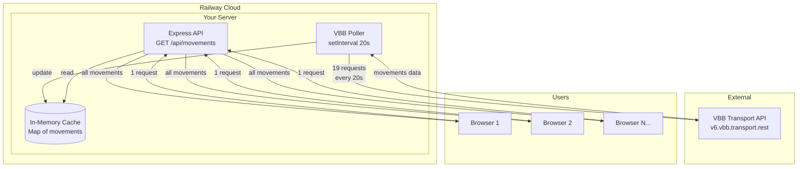

# Backend Cache Implementation Plan

## Overview

### What You're Building
A Node.js backend server that:
1. Polls the VBB real-time API every 20 seconds (same as your current frontend)
2. Stores all vehicle positions in memory
3. Exposes a single API endpoint for your frontend to consume
4. Deploys to Railway

### Why This Architecture
```
BEFORE (Current):
┌─────────────────────────────────────────────────────────────┐
│  Each browser makes ~19 API calls every 20 seconds          │
│  → 10 users = 190 calls/20s = 570 calls/min (over limit!)   │
│  → You're limited to ~1 concurrent user                     │
└─────────────────────────────────────────────────────────────┘

   Browser ──19 requests──► VBB API (limit: 100/min)

AFTER (New Architecture):
┌─────────────────────────────────────────────────────────────┐
│  Your server makes ~19 API calls every 20 seconds           │
│  → Always ~57 calls/min regardless of user count            │
│  → Unlimited concurrent users can read from your server     │
└─────────────────────────────────────────────────────────────┘

   Browser ──1 request──► Your Server ──19 requests──► VBB API
```

### Benefits
- **Scalability**: Serve thousands of users without hitting VBB rate limits
- **Speed**: Users get instant responses from your cached data
- **Control**: Add features like WebSocket push, historical data, filtering
- **Reliability**: Your server can handle VBB outages gracefully

---

## Project Structure

```
learning_maps/
├── backend/                    # NEW: Backend server
│   ├── package.json
│   ├── index.js               # Express server + API endpoints
│   ├── vbbPoller.js           # Background job that fetches from VBB
│   ├── cache.js               # In-memory data store
│   └── config.js              # Configuration (bbox definitions, etc.)
│
├── index.html                 # MODIFIED: Point to your API
├── map.js                     # MODIFIED: Fetch from your server
├── vbb_data.js                # MODIFIED: Call your API instead of VBB
├── map.css
└── ... (other existing files)
```

---

## Implementation Steps

### Phase 1: Create the Backend Server

#### Step 1.1: Initialize the Server Project

Create a new `backend` directory and initialize a Node.js project.

**What you're doing**: Setting up a separate Node.js application that will run on Railway.

**Files to create**:
- `backend/package.json` - Dependencies and scripts
- `backend/.gitignore` - Ignore node_modules

**Dependencies needed**:
- `express` - Web server framework
- `cors` - Allow your frontend to call the API

---

#### Step 1.2: Create the In-Memory Cache Module

**File**: `backend/cache.js`

**What you're doing**: Creating a simple data store that holds all current vehicle movements in memory.

**Why in-memory**: 
- Vehicle positions are stale after 20 seconds anyway
- Memory reads are instant (microseconds vs milliseconds for database)
- If server restarts, cache rebuilds automatically on next poll

**Data structure**:
```javascript
// The cache stores movements keyed by tripId for fast lookups
{
  movements: Map<tripId, MovementData>,
  lastUpdated: timestamp,
  polygonStats: { polygonId: count, ... }
}
```

**Functions to implement**:
- `getAll()` - Return all current movements as an array
- `update(movements)` - Replace cache with fresh data
- `getStats()` - Return metadata (count, last updated, etc.)

---

#### Step 1.3: Create the VBB Polling Module

**File**: `backend/vbbPoller.js`

**What you're doing**: Moving your current `getData()` logic from the frontend to the backend, running it on a timer.

**Key differences from frontend version**:
- Uses native fetch (Node 18+)
- Runs in a `setInterval` loop
- Stores results in the cache module instead of returning them
- Handles all 19 bounding boxes in sequence or parallel

**Configuration to extract from your current map.js**:
```javascript
// These are currently hardcoded in map.js - extract them:
const BOUNDING_BOXES = [
  { north: 52.6755, south: 52.5913, west: 13.0884, east: 13.2566, id: '1' },
  // ... all 19 boxes (including the subdivided ones)
];

const POLL_INTERVAL_MS = 20000; // 20 seconds
```

**Flow**:
```
Every 20 seconds:
  1. Fetch all 19 bounding boxes from VBB (parallel with Promise.all)
  2. Flatten results into single array
  3. Deduplicate by tripId (vehicles can appear in overlapping boxes)
  4. Update the cache
  5. Log stats (request count, vehicle count)
```

---

#### Step 1.4: Create the Express Server - dones

**File**: `backend/index.js`

**What you're doing**: Creating an HTTP server that exposes your cached data to the frontend.

**Endpoints to implement**:

| Endpoint | Method | Description |
|----------|--------|-------------|
| `/api/movements` | GET | Returns all current vehicle movements |
| `/api/stats` | GET | Returns cache metadata (count, last updated) |
| `/health` | GET | Health check for Railway |

**CORS Configuration**:
```javascript
// Allow requests from your frontend domain
cors({
  origin: [
    'http://localhost:5500',      // VS Code Live Server
    'http://127.0.0.1:5500',
    'https://your-frontend.com'   // Production frontend
  ]
})
```

**Response format** (keep same structure as current `getData()` return value):
```json
{
  "movements": [
    {
      "name": "U2",
      "direction": "Pankow",
      "tripId": "...",
      "latitude": 52.52,
      "longitude": 13.41,
      "type": "subway"
    }
  ],
  "meta": {
    "count": 847,
    "lastUpdated": "2024-01-15T10:30:00Z",
    "ageMs": 5000
  }
}
```

---

#### Step 1.5: Create Configuration Module - done

**File**: `backend/config.js`

**What you're doing**: Centralizing all configuration in one place, using environment variables where appropriate.

**Configuration items**:
```javascript
module.exports = {
  // Server
  PORT: process.env.PORT || 3000,
  
  // CORS
  ALLOWED_ORIGINS: process.env.ALLOWED_ORIGINS?.split(',') || ['http://localhost:5500'],
  
  // VBB API
  VBB_BASE_URL: 'https://v6.vbb.transport.rest',
  POLL_INTERVAL_MS: 20000,
  
  // Bounding boxes (the 19 grid squares from map.js)
  BOUNDING_BOXES: [
    // ... extracted from map.js
  ]
};
```

---

### Phase 2: Modify the Frontend

#### Step 2.1: Update vbb_data.js

**What you're doing**: Changing the data source from VBB API to your backend.

**Changes**:
```javascript
// BEFORE
const url = `https://v6.vbb.transport.rest/radar?${bbox}`;

// AFTER
const API_BASE = 'https://your-app.railway.app'; // or localhost for dev
const url = `${API_BASE}/api/movements`;
```

**Important**: The frontend now makes ONE request to get ALL movements, instead of 19 requests for each bounding box.

---

#### Step 2.2: Update map.js

**What you're doing**: Simplifying the update logic since the backend now handles all the bounding box fetching.

**Changes**:
```javascript
// BEFORE: Fetch each bounding box separately
const results = await Promise.all(
  boxes.map(({ bbox, polygonId }) => getData(bbox, polygonId))
);
const allData = results.flat();

// AFTER: Single fetch for all data
const allData = await getData(); // No bbox needed - server has all data
```

---

#### Step 2.3: Update rateLimitTracker.js (Optional)

**What you're doing**: The rate limit tracker becomes less critical since your server handles the VBB API calls. You can either:

1. **Remove it entirely** - The frontend doesn't hit VBB anymore
2. **Keep it for monitoring** - Track requests to YOUR server
3. **Move it to backend** - Monitor VBB API usage from the server

Recommendation: Move to backend so you can see VBB usage in Railway logs.

---

### Phase 3: Deploy to Railway

#### Step 3.1: Prepare for Railway Deployment

**What you're doing**: Configuring your server for Railway's environment.

**Required in package.json**:
```json
{
  "scripts": {
    "start": "node index.js",
    "dev": "node --watch index.js"
  },
  "engines": {
    "node": ">=18.0.0"
  }
}
```

---

#### Step 3.2: Deploy to Railway

**What you're doing**: Deploying your backend to Railway's cloud platform.

**Steps**:
1. Create a Railway account at railway.app
2. Create a new project
3. Connect your GitHub repository OR use Railway CLI
4. Set the root directory to `backend/`
5. Railway auto-detects Node.js and runs `npm start`
6. Note your deployment URL (e.g., `https://your-app.up.railway.app`)

**Environment variables to set in Railway**:
- `ALLOWED_ORIGINS` = `https://your-frontend-domain.com`

---

#### Step 3.3: Update Frontend to Use Production URL

**What you're doing**: Pointing your frontend to the deployed backend.

**Create environment handling**:
```javascript
const API_BASE = window.location.hostname === 'localhost' 
  ? 'http://localhost:3000'
  : 'https://your-app.up.railway.app';
```

---

## Architecture Diagram



---

## Data Flow Comparison

### Before (Current)
```
User opens page
  └── Browser calls getData() for 19 boxes
        └── 19 parallel requests to VBB API
              └── VBB returns movements for each box
                    └── Frontend merges and displays

Problem: Each user = 19 requests every 20 seconds
10 users = 190 requests/20s = 570/min (OVER LIMIT)
```

### After (New)
```
Server starts
  └── Poller begins 20-second loop
        └── Fetches 19 boxes from VBB
              └── Stores in memory cache

User opens page
  └── Browser calls YOUR /api/movements
        └── Server returns cached data instantly
              └── Frontend displays

Benefit: Server = 57 requests/min (fixed)
Unlimited users can read from your cache
```

---

## Files Summary

### New Files to Create
| File | Purpose |
|------|---------|
| `server/package.json` | Node.js project config and dependencies |
| `server/index.js` | Express server, routes, CORS |
| `server/cache.js` | In-memory storage for movements |
| `server/vbbPoller.js` | Background job fetching from VBB |
| `server/config.js` | Centralized configuration |

### Existing Files to Modify
| File | Changes |
|------|---------|
| `vbb_data.js` | Change URL to your API, simplify logic |
| `map.js` | Remove bbox loop, call simplified getData() |
| `rateLimitTracker.js` | Optional: remove or repurpose |

---

## Testing Checklist

### Local Development
- [ ] Server starts without errors
- [ ] Server logs show VBB polling every 20 seconds
- [ ] `curl http://localhost:3000/api/movements` returns data
- [ ] `curl http://localhost:3000/api/stats` returns cache metadata
- [ ] Frontend map shows vehicles when pointing to localhost:3000

### Production (Railway)
- [ ] Deployment succeeds in Railway dashboard
- [ ] Railway logs show polling activity
- [ ] `curl https://your-app.railway.app/api/movements` works
- [ ] Frontend works with production API URL
- [ ] CORS allows your frontend domain

---

## Quick Reference

### Commands

```bash
# Install dependencies
cd server && npm install

# Run locally
npm run dev

# Test endpoints
curl http://localhost:3000/api/movements
curl http://localhost:3000/api/stats
curl http://localhost:3000/health
```

### Environment Variables

| Variable | Description | Example |
|----------|-------------|---------|
| `PORT` | Server port (Railway sets this) | `3000` |
| `ALLOWED_ORIGINS` | CORS whitelist (comma-separated) | `https://example.com` |

---

## Future Enhancements (Optional)

Once this is working, you could add:

1. **WebSocket for real-time push** - Instead of frontend polling every 20s, server pushes updates
2. **Historical data** - Add SQLite/PostgreSQL to store positions over time
3. **Filtering endpoint** - `/api/movements?type=subway&line=U2`
4. **Geospatial queries** - `/api/movements?near=52.52,13.41&radius=1km`
5. **Status page** - Show current vehicle count, API health, etc.
