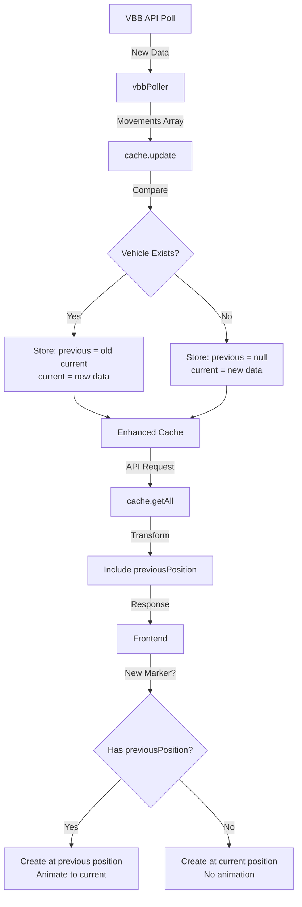

# Position History Animation Fix

## Problem Statement

When users first load the app, vehicle markers (dots) appear on the map but remain stationary until the next poll cycle (20 seconds). This creates a poor first impression as the map looks static rather than showing real-time movement.

**Root Cause:**
- New markers are created at their current position without animation (lines 156-164 in [`map.js`](../map.js:156))
- Animation via [`animateMarker()`](../map.js:198) only triggers for existing markers receiving updated positions (line 176)
- On first load, all markers are new → no animation → static for 20 seconds

## Recommended Solution: Backend Position History

### Why This Approach?

1. **Solves First Impression Problem** - Even first-time users see movement immediately
2. **Page Refresh Resilience** - Users who refresh still get animated dots (unlike client-side storage)
3. **Single Source of Truth** - Backend maintains consistency for all clients
4. **Minimal Frontend Changes** - Frontend logic stays simple
5. **No Additional API Calls** - Reuses existing polling infrastructure

### Architecture Changes



## Technical Design

### 1. Backend Cache Enhancement

**File: [`backend/cache.js`](../backend/cache.js)**

**Current Structure:**
```javascript
const cache = {
    movements: Map<tripId, movement>,
    lastUpdated: Date,
    updateCount: number
}
```

**Enhanced Structure:**
```javascript
const cache = {
    movements: Map<tripId, {
        current: {
            name: string,
            direction: string,
            tripId: string,
            latitude: number,
            longitude: number,
            type: string,
            timestamp: Date
        },
        previous: {
            latitude: number,
            longitude: number,
            timestamp: Date
        } | null,
        firstSeen: Date
    }>,
    lastUpdated: Date,
    updateCount: number
}
```

**Key Functions to Modify:**

#### `update(movements)` Function
```javascript
function update(movements) {
    // Step 1: Preserve previous positions for existing vehicles
    const updatedVehicles = new Map();
    
    for (const newMovement of movements) {
        const existing = cache.movements.get(newMovement.tripId);
        
        if (existing) {
            // Vehicle exists - shift current to previous
            updatedVehicles.set(newMovement.tripId, {
                current: {
                    ...newMovement,
                    timestamp: new Date()
                },
                previous: {
                    latitude: existing.current.latitude,
                    longitude: existing.current.longitude,
                    timestamp: existing.current.timestamp
                },
                firstSeen: existing.firstSeen
            });
        } else {
            // New vehicle - no previous position
            updatedVehicles.set(newMovement.tripId, {
                current: {
                    ...newMovement,
                    timestamp: new Date()
                },
                previous: null,
                firstSeen: new Date()
            });
        }
    }
    
    // Step 2: Replace cache with updated data
    cache.movements = updatedVehicles;
    cache.lastUpdated = new Date();
    cache.updateCount += 1;
    
    console.log(`[Cache] Updated: ${cache.movements.size} movements (${movements.length - updatedVehicles.size} new)`);
}
```

#### `getAll()` Function
```javascript
function getAll() {
    return Array.from(cache.movements.values()).map(vehicle => ({
        // Current position data
        name: vehicle.current.name,
        direction: vehicle.current.direction,
        tripId: vehicle.current.tripId,
        latitude: vehicle.current.latitude,
        longitude: vehicle.current.longitude,
        type: vehicle.current.type,
        
        // Previous position for animation (new field)
        previousPosition: vehicle.previous ? {
            latitude: vehicle.previous.latitude,
            longitude: vehicle.previous.longitude
        } : null
    }));
}
```

### 2. API Response Format

**Endpoint: `/api/movements`**

**Current Response:**
```json
{
  "movements": [
    {
      "tripId": "123",
      "latitude": 52.52,
      "longitude": 13.41,
      "name": "M10",
      "direction": "Hauptbahnhof",
      "type": "tram"
    }
  ],
  "meta": {
    "count": 42,
    "ageMs": 1500,
    "lastUpdated": "2025-12-21T22:00:00.000Z",
    "isHealthy": true
  }
}
```

**Enhanced Response:**
```json
{
  "movements": [
    {
      "tripId": "123",
      "latitude": 52.52,
      "longitude": 13.41,
      "name": "M10",
      "direction": "Hauptbahnhof",
      "type": "tram",
      "previousPosition": {
        "latitude": 52.519,
        "longitude": 13.408
      }
    },
    {
      "tripId": "456",
      "latitude": 52.515,
      "longitude": 13.405,
      "name": "U2",
      "direction": "Pankow",
      "type": "subway",
      "previousPosition": null
    }
  ],
  "meta": {
    "count": 42,
    "ageMs": 1500,
    "lastUpdated": "2025-12-21T22:00:00.000Z",
    "isHealthy": true
  }
}
```

**Breaking Changes:** None - `previousPosition` is additive and defaults to `null` for backward compatibility.

### 3. Frontend Changes

**File: [`map.js`](../map.js)**

#### Modify `updateMarkers()` Function

**Current Logic (Lines 155-178):**
```javascript
if (!markers.has(movement.tripId)) {
    // Create new marker at current position
    const createdMarker = L.circleMarker(
        [movement.latitude, movement.longitude],
        getMarkerStyle(movement.type)
    ).addTo(markersLayer).bindPopup(...);
    
    markers.set(movement.tripId, {
        marker: createdMarker,
        misses: 0,
        lastSeen: Date.now(),
        type: movement.type
    });
} else {
    // Update existing marker
    const entry = markers.get(movement.tripId);
    entry.misses = 0;
    entry.lastSeen = Date.now();
    animateMarker(entry.marker, movement.latitude, movement.longitude);
    entry.marker.setStyle(getMarkerStyle(entry.type));
}
```

**Enhanced Logic:**
```javascript
if (!markers.has(movement.tripId)) {
    // Determine starting position
    let startLat, startLng;
    
    if (movement.previousPosition) {
        // Start at previous position for immediate animation
        startLat = movement.previousPosition.latitude;
        startLng = movement.previousPosition.longitude;
    } else {
        // No history - start at current position
        startLat = movement.latitude;
        startLng = movement.longitude;
    }
    
    // Create new marker
    const createdMarker = L.circleMarker(
        [startLat, startLng],
        getMarkerStyle(movement.type)
    ).addTo(markersLayer).bindPopup(
        `Name: ${movement.name}<br>
        Direction: ${movement.direction}<br>
        tripId: ${movement.tripId}<br>
        type: ${movement.type}`
    );
    
    markers.set(movement.tripId, {
        marker: createdMarker,
        misses: 0,
        lastSeen: Date.now(),
        type: movement.type
    });
    
    // Start animation if we have previous position
    if (movement.previousPosition) {
        animateMarker(createdMarker, movement.latitude, movement.longitude);
    }
} else {
    // Update existing marker (unchanged)
    const entry = markers.get(movement.tripId);
    entry.misses = 0;
    entry.lastSeen = Date.now();
    animateMarker(entry.marker, movement.latitude, movement.longitude);
    entry.marker.setStyle(getMarkerStyle(entry.type));
}
```

**Note:** No changes needed to [`animateMarker()`](../map.js:198) function - it already works correctly.

## Implementation Phases

### Phase 1: Backend Cache Enhancement ⚙️

**File: [`backend/cache.js`](../backend/cache.js)**

- [ ] Modify private cache structure
  - Update `cache.movements` Map schema
  - Add `current`, `previous`, `firstSeen` fields

- [ ] Update `update()` function
  - Preserve previous positions for existing vehicles
  - Handle new vehicles (set `previous = null`)
  - Add timestamp tracking

- [ ] Update `getAll()` function  
  - Transform internal structure to API format
  - Include `previousPosition` field
  - Return null for new vehicles without history

- [ ] Add optional: position change detection
  - Calculate distance between current and previous
  - Skip animation if distance < threshold (e.g., 10 meters)
  - Prevents jitter for stationary vehicles at stops

### Phase 2: API Response Validation ✅

**File: [`backend/index.js`](../backend/index.js)**

- [ ] Verify `/api/movements` endpoint
  - Response includes `previousPosition` field
  - Field is null for new vehicles
  - No breaking changes to existing fields

- [ ] Add documentation
  - Comment explaining `previousPosition` field
  - Note that it enables immediate animation for new clients

### Phase 3: Frontend Animation Logic 🎨

**File: [`map.js`](../map.js)**

- [ ] Modify `updateMarkers()` function (lines 139-191)
  - Check for `movement.previousPosition` when creating new markers
  - If exists: create marker at previous position, then animate to current
  - If null: create marker at current position (no animation)

- [ ] Test animation behavior
  - New markers with history animate immediately
  - New markers without history appear stationary (correct behavior)
  - Existing markers continue animating as before

### Phase 4: Testing & Validation 🧪

#### Backend Tests
- [ ] Position history persistence
  - Poll 1: Vehicle appears (previous = null)
  - Poll 2: Same vehicle moves (previous = Poll 1 position)
  - Poll 3: Vehicle continues (previous = Poll 2 position)

- [ ] Memory management
  - Cache size doesn't grow unbounded
  - Vehicles that disappear are removed (existing cleanup works)
  - Only storing 1 previous position per vehicle (minimal overhead)

- [ ] Edge cases
  - Very first poll after server start (all vehicles new)
  - Vehicle reappears after being cleaned up (treated as new)
  - Rapid position changes (20s poll interval limits this)

#### Frontend Tests
- [ ] First-time user experience
  - Load page for first time
  - Verify most vehicles animate immediately (have history from backend)
  - New vehicles appear stationary until next poll (expected)

- [ ] Page refresh behavior
  - Refresh page while vehicles are moving
  - Verify animation continues from previous position
  - No static period on refresh

- [ ] Marker lifecycle
  - New vehicles appear correctly
  - Existing vehicles update correctly
  - Disappearing vehicles are cleaned up (unchanged)

#### Integration Tests
- [ ] Backend → Frontend flow
  - Backend serves previousPosition
  - Frontend receives and parses correctly
  - Animation starts immediately on marker creation

- [ ] Multi-user scenario
  - User A loads page (sees animation)
  - User B loads page 10 seconds later (also sees animation)
  - Both users see same vehicles at correct positions

### Phase 5: Optimization (Optional) 🚀

- [ ] Configuration options
  - Make position history depth configurable
  - Currently: 1 previous position
  - Could extend: Last N positions for smoother curves

- [ ] Performance monitoring
  - Log cache memory usage
  - Track animation frame rate
  - Monitor for any lag with high vehicle counts

- [ ] Distance threshold
  - Don't animate vehicles that moved < 10 meters
  - Prevents jitter for vehicles at stops
  - Configurable threshold

## Expected Results

### Before Fix
- User loads page → sees ~40-60 stationary dots
- Wait 20 seconds → dots start moving
- Poor first impression, looks like static data

### After Fix
- User loads page → sees ~90% of dots moving immediately
- ~10% new/just-appeared vehicles are stationary (expected)
- Good first impression, clearly shows real-time data
- Page refresh maintains animation

## Risk Assessment

### Low Risk ✅
- **Backward Compatibility:** Frontend gracefully handles `previousPosition: null`
- **Memory Impact:** Only storing 1 extra position per vehicle (~16 bytes × 60 vehicles = ~1KB)
- **API Changes:** Additive only, no breaking changes
- **Existing Functionality:** All current features continue working

### Considerations ⚠️
- **Very First Load:** When backend first starts, no vehicles have history (0-20s window)
- **Network Overhead:** Response size increases slightly (~30% larger with previous positions)
- **Stale Data:** If user loads page near end of 20s cycle, might see brief backwards movement (minor visual glitch)

## Alternative Solutions (Not Recommended)

### Option 1: Client-Side Storage
Store positions in localStorage/sessionStorage
- ❌ Doesn't help first-time users
- ❌ Lost on cache clear
- ✅ Zero backend changes needed

### Option 2: Predictive Animation
Extrapolate movement direction and animate speculatively
- ❌ Inaccurate for vehicles that turn/stop
- ❌ Complex interpolation logic
- ❌ Wrong direction creates worse UX than no movement

### Option 3: Loading State/Skeleton
Show loading animation for first 20 seconds
- ❌ Doesn't solve the problem, just masks it
- ❌ Annoying delay for users
- ✅ Very easy to implement

## Next Steps

1. Review this plan and confirm approach
2. Switch to Code mode for implementation
3. Implement Phase 1 (backend cache)
4. Test backend changes
5. Implement Phase 3 (frontend)
6. End-to-end testing
7. Deploy and monitor

## Files to Modify

| File | Purpose | Lines Changed |
|------|---------|---------------|
| [`backend/cache.js`](../backend/cache.js) | Store position history | ~40 lines |
| [`map.js`](../map.js) | Animate new markers with history | ~15 lines |

**Total Implementation:** ~55 lines of code changes
**Breaking Changes:** None
**Testing Required:** Backend unit tests + frontend integration tests
