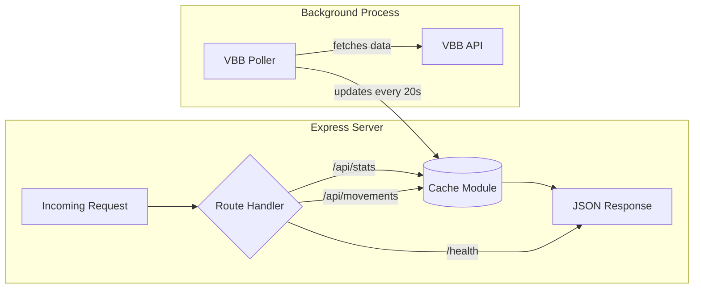

# Step 1.4: Express Server Implementation Guide

## Overview

This guide walks you through implementing the Express server ([`backend/index.js`](../backend/index.js)) that serves cached vehicle data to your frontend. The server acts as an intermediary between your users and the VBB API, solving the rate limit problem.

**Current Status:**
- ✅ [`backend/cache.js`](../backend/cache.js) - Implemented
- ✅ [`backend/vbbPoller.js`](../backend/vbbPoller.js) - Implemented  
- ❌ [`backend/index.js`](../backend/index.js) - **Empty - needs implementation**
- ⚠️ [`backend/package.json`](../backend/package.json) - Needs correction (main should be "index.js" not "server.js")

---

## Architecture Overview



---

## Implementation Steps

### Step 1: Update package.json

**Issue Found:** The main field points to "server.js" but we're creating "index.js"

**Fix:**
```json
{
  "main": "index.js",
  "scripts": {
    "start": "node index.js",
    "dev": "node --watch index.js"
  }
}
```

---

### Step 2: Create the Express Server Structure

Create [`backend/index.js`](../backend/index.js) with the following structure:

```javascript
import express from 'express';
import cors from 'cors';
import cache from './cache.js';
import poller from './vbbPoller.js';

const app = express();
const PORT = process.env.PORT || 3000;

// Middleware configuration
// API routes
// Server startup
// Graceful shutdown
```

---

### Step 3: Configure CORS Middleware

**Why CORS is needed:** Your frontend (served from one origin) will make requests to your backend (different origin). Without CORS, browsers block these requests.

**What to implement:**

```javascript
// CORS Configuration
const ALLOWED_ORIGINS = process.env.ALLOWED_ORIGINS 
  ? process.env.ALLOWED_ORIGINS.split(',')
  : [
      'http://localhost:5500',      // VS Code Live Server
      'http://127.0.0.1:5500',      // Alternative localhost
      'http://localhost:5501',      // Alternative port
      'http://127.0.0.1:5501'       // Alternative port
    ];

const corsOptions = {
  origin: function (origin, callback) {
    // Allow requests with no origin (like mobile apps or curl)
    if (!origin) return callback(null, true);
    
    if (ALLOWED_ORIGINS.indexOf(origin) !== -1) {
      callback(null, true);
    } else {
      console.warn(`[CORS] Blocked request from origin: ${origin}`);
      callback(new Error('Not allowed by CORS'));
    }
  },
  credentials: true,
  optionsSuccessStatus: 200
};

app.use(cors(corsOptions));
app.use(express.json());
```

**CORS Configuration Explained:**
- **Development:** Allows localhost on common Live Server ports
- **Production:** Use `ALLOWED_ORIGINS` environment variable on Railway
- **Security:** Only whitelisted origins can access your API

---

### Step 4: Implement API Endpoints

#### Endpoint 1: GET /api/movements

**Purpose:** Return all currently cached vehicle movements

**Response Format:**
```json
{
  "movements": [
    {
      "name": "U2",
      "direction": "Pankow",
      "tripId": "1|12345|...",
      "latitude": 52.52,
      "longitude": 13.41,
      "type": "subway"
    }
  ],
  "meta": {
    "count": 847,
    "lastUpdated": "2024-01-15T10:30:00.000Z",
    "ageMs": 5234,
    "isHealthy": true
  }
}
```

**Implementation:**

```javascript
app.get('/api/movements', (req, res) => {
  try {
    const movements = cache.getAll();
    const stats = cache.getStats();

    res.json({
      movements: movements,
      meta: {
        count: stats.count,
        lastUpdated: stats.lastUpdated,
        ageMs: stats.ageMs,
        isHealthy: stats.isHealthy
      }
    });

    console.log(`[API] /api/movements - Served ${movements.length} movements`);
  } catch (error) {
    console.error('[API] /api/movements error:', error);
    res.status(500).json({ error: 'Internal server error' });
  }
});
```

**Why this structure:**
- Frontend gets movement data in the exact same format as before
- Meta information helps frontend display cache age/health
- Error handling prevents server crashes

---

#### Endpoint 2: GET /api/stats

**Purpose:** Return cache statistics without movement data (lighter response for monitoring)

**Response Format:**
```json
{
  "count": 847,
  "lastUpdated": "2024-01-15T10:30:00.000Z",
  "ageMs": 5234,
  "updateCount": 42,
  "isHealthy": true
}
```

**Implementation:**

```javascript
app.get('/api/stats', (req, res) => {
  try {
    const stats = cache.getStats();
    res.json(stats);

    console.log(`[API] /api/stats - Cache has ${stats.count} movements, age: ${stats.ageMs}ms`);
  } catch (error) {
    console.error('[API] /api/stats error:', error);
    res.status(500).json({ error: 'Internal server error' });
  }
});
```

**Use cases:**
- Frontend health checks
- Monitoring dashboards
- Debugging cache updates

---

#### Endpoint 3: GET /health

**Purpose:** Railway deployment health check

**Response Format:**
```json
{
  "status": "healthy",
  "timestamp": "2024-01-15T10:30:00.000Z",
  "uptime": 3600.5,
  "cache": {
    "count": 847,
    "ageMs": 5234,
    "isHealthy": true
  }
}
```

**Implementation:**

```javascript
app.get('/health', (req, res) => {
  const stats = cache.getStats();
  
  const health = {
    status: stats.isHealthy ? 'healthy' : 'degraded',
    timestamp: new Date().toISOString(),
    uptime: process.uptime(),
    cache: {
      count: stats.count,
      ageMs: stats.ageMs,
      isHealthy: stats.isHealthy
    }
  };

  // Return 503 if cache is stale (allows Railway to restart if needed)
  const statusCode = stats.isHealthy ? 200 : 503;
  res.status(statusCode).json(health);

  if (!stats.isHealthy) {
    console.warn('[Health] Cache unhealthy, returning 503');
  }
});
```

**Why Railway needs this:**
- Railway pings `/health` to verify the service is running
- 503 status code tells Railway something is wrong
- Automatic restart if health checks fail repeatedly

---

### Step 5: Implement Server Startup

**What to implement:**

```javascript
// Start the poller before starting the server
poller.start();

// Start the Express server
const server = app.listen(PORT, () => {
  console.log(`┌─────────────────────────────────────────┐`);
  console.log(`│  🚀 Server running on port ${PORT}         │`);
  console.log(`│  📡 VBB Poller active (20s interval)    │`);
  console.log(`│  🌍 CORS allowed origins:               │`);
  ALLOWED_ORIGINS.forEach(origin => {
    console.log(`│     - ${origin.padEnd(33)}│`);
  });
  console.log(`└─────────────────────────────────────────┘`);
  console.log('');
  console.log('API Endpoints:');
  console.log(`  GET http://localhost:${PORT}/api/movements`);
  console.log(`  GET http://localhost:${PORT}/api/stats`);
  console.log(`  GET http://localhost:${PORT}/health`);
  console.log('');
});
```

**Startup Sequence:**
1. Import dependencies (express, cors, cache, poller)
2. Configure Express app and middleware
3. Define all routes
4. **Start poller first** (begins fetching data)
5. Start Express server
6. Log startup information

**Why start poller first:** Cache will begin populating immediately, so the first API request has data available.

---

### Step 6: Implement Graceful Shutdown

**Why graceful shutdown matters:**
- Cleans up resources (stops poller interval)
- Prevents incomplete requests
- Railway expects clean shutdowns on redeployment

**What to implement:**

```javascript
// Graceful shutdown handler
function shutdown() {
  console.log('\n[Shutdown] Received shutdown signal');
  console.log('[Shutdown] Stopping VBB poller...');
  poller.stop();
  
  console.log('[Shutdown] Closing Express server...');
  server.close(() => {
    console.log('[Shutdown] Server closed. Goodbye! 👋');
    process.exit(0);
  });

  // Force shutdown after 10 seconds
  setTimeout(() => {
    console.error('[Shutdown] Forced shutdown after timeout');
    process.exit(1);
  }, 10000);
}

// Listen for termination signals
process.on('SIGTERM', shutdown);
process.on('SIGINT', shutdown);
```

**Signals explained:**
- `SIGTERM` - Railway sends this when redeploying
- `SIGINT` - Ctrl+C in terminal during development

---

### Step 7: Add Request Logging (Optional but Recommended)

**What to implement:**

```javascript
// Request logging middleware (add after CORS)
app.use((req, res, next) => {
  const start = Date.now();
  
  res.on('finish', () => {
    const duration = Date.now() - start;
    console.log(`[${new Date().toISOString()}] ${req.method} ${req.path} ${res.statusCode} - ${duration}ms`);
  });
  
  next();
});
```

**Why logging helps:**
- Debug issues in production
- Monitor which endpoints are used most
- Track response times

---

## Complete Implementation

Here's the complete [`backend/index.js`](../backend/index.js) file:

```javascript
import express from 'express';
import cors from 'cors';
import cache from './cache.js';
import poller from './vbbPoller.js';

const app = express();
const PORT = process.env.PORT || 3000;

// ============================================================================
// CORS CONFIGURATION
// ============================================================================

const ALLOWED_ORIGINS = process.env.ALLOWED_ORIGINS 
  ? process.env.ALLOWED_ORIGINS.split(',')
  : [
      'http://localhost:5500',
      'http://127.0.0.1:5500',
      'http://localhost:5501',
      'http://127.0.0.1:5501'
    ];

const corsOptions = {
  origin: function (origin, callback) {
    // Allow requests with no origin (curl, mobile apps, etc.)
    if (!origin) return callback(null, true);
    
    if (ALLOWED_ORIGINS.indexOf(origin) !== -1) {
      callback(null, true);
    } else {
      console.warn(`[CORS] Blocked request from origin: ${origin}`);
      callback(new Error('Not allowed by CORS'));
    }
  },
  credentials: true,
  optionsSuccessStatus: 200
};

app.use(cors(corsOptions));
app.use(express.json());

// ============================================================================
// REQUEST LOGGING MIDDLEWARE
// ============================================================================

app.use((req, res, next) => {
  const start = Date.now();
  
  res.on('finish', () => {
    const duration = Date.now() - start;
    console.log(`[${new Date().toISOString()}] ${req.method} ${req.path} ${res.statusCode} - ${duration}ms`);
  });
  
  next();
});

// ============================================================================
// API ROUTES
// ============================================================================

/**
 * GET /api/movements
 * Returns all current vehicle movements with metadata
 */
app.get('/api/movements', (req, res) => {
  try {
    const movements = cache.getAll();
    const stats = cache.getStats();

    res.json({
      movements: movements,
      meta: {
        count: stats.count,
        lastUpdated: stats.lastUpdated,
        ageMs: stats.ageMs,
        isHealthy: stats.isHealthy
      }
    });

    console.log(`[API] /api/movements - Served ${movements.length} movements`);
  } catch (error) {
    console.error('[API] /api/movements error:', error);
    res.status(500).json({ error: 'Internal server error' });
  }
});

/**
 * GET /api/stats
 * Returns cache statistics without movement data
 */
app.get('/api/stats', (req, res) => {
  try {
    const stats = cache.getStats();
    res.json(stats);

    console.log(`[API] /api/stats - Cache has ${stats.count} movements, age: ${stats.ageMs}ms`);
  } catch (error) {
    console.error('[API] /api/stats error:', error);
    res.status(500).json({ error: 'Internal server error' });
  }
});

/**
 * GET /health
 * Health check endpoint for Railway and monitoring
 */
app.get('/health', (req, res) => {
  const stats = cache.getStats();
  
  const health = {
    status: stats.isHealthy ? 'healthy' : 'degraded',
    timestamp: new Date().toISOString(),
    uptime: process.uptime(),
    cache: {
      count: stats.count,
      ageMs: stats.ageMs,
      isHealthy: stats.isHealthy
    }
  };

  const statusCode = stats.isHealthy ? 200 : 503;
  res.status(statusCode).json(health);

  if (!stats.isHealthy) {
    console.warn('[Health] Cache unhealthy, returning 503');
  }
});

// ============================================================================
// 404 HANDLER
// ============================================================================

app.use((req, res) => {
  res.status(404).json({ 
    error: 'Not Found',
    message: `Route ${req.method} ${req.path} does not exist`,
    availableEndpoints: [
      'GET /api/movements',
      'GET /api/stats',
      'GET /health'
    ]
  });
});

// ============================================================================
// SERVER STARTUP
// ============================================================================

// Start the VBB poller
poller.start();

// Start the Express server
const server = app.listen(PORT, () => {
  console.log(`┌─────────────────────────────────────────┐`);
  console.log(`│  🚀 Server running on port ${PORT.toString().padEnd(4)}        │`);
  console.log(`│  📡 VBB Poller active (20s interval)    │`);
  console.log(`│  🌍 CORS allowed origins:               │`);
  ALLOWED_ORIGINS.forEach(origin => {
    console.log(`│     - ${origin.padEnd(33)}│`);
  });
  console.log(`└─────────────────────────────────────────┘`);
  console.log('');
  console.log('API Endpoints:');
  console.log(`  GET http://localhost:${PORT}/api/movements`);
  console.log(`  GET http://localhost:${PORT}/api/stats`);
  console.log(`  GET http://localhost:${PORT}/health`);
  console.log('');
});

// ============================================================================
// GRACEFUL SHUTDOWN
// ============================================================================

function shutdown() {
  console.log('\n[Shutdown] Received shutdown signal');
  console.log('[Shutdown] Stopping VBB poller...');
  poller.stop();
  
  console.log('[Shutdown] Closing Express server...');
  server.close(() => {
    console.log('[Shutdown] Server closed. Goodbye! 👋');
    process.exit(0);
  });

  // Force shutdown after 10 seconds
  setTimeout(() => {
    console.error('[Shutdown] Forced shutdown after timeout');
    process.exit(1);
  }, 10000);
}

// Listen for termination signals
process.on('SIGTERM', shutdown);
process.on('SIGINT', shutdown);
```

---

## Testing Your Implementation

### Local Development Testing

#### Step 1: Start the Server

```bash
cd backend
npm run dev
```

**Expected output:**
```
[Poller] Starting (20000ms interval, 19 boxes)
[Poller] Fetching 19 bounding boxes...
┌─────────────────────────────────────────┐
│  🚀 Server running on port 3000         │
│  📡 VBB Poller active (20s interval)    │
│  🌍 CORS allowed origins:               │
│     - http://localhost:5500             │
│     - http://127.0.0.1:5500             │
└─────────────────────────────────────────┘

API Endpoints:
  GET http://localhost:3000/api/movements
  GET http://localhost:3000/api/stats
  GET http://localhost:3000/health

[Poller] Fetched 1847 movements, 847 unique
[Cache] Updated: 847 movements
[Poller] Poll completed in 3421ms
```

---

#### Step 2: Test Endpoints with curl

**Test /api/movements:**
```bash
curl http://localhost:3000/api/movements | jq
```

**Expected response:**
```json
{
  "movements": [
    {
      "name": "U2",
      "direction": "Pankow",
      "tripId": "1|12345|...",
      "latitude": 52.52,
      "longitude": 13.41,
      "type": "subway"
    }
    // ... more movements
  ],
  "meta": {
    "count": 847,
    "lastUpdated": "2024-01-15T10:30:00.000Z",
    "ageMs": 5234,
    "isHealthy": true
  }
}
```

---

**Test /api/stats:**
```bash
curl http://localhost:3000/api/stats | jq
```

**Expected response:**
```json
{
  "count": 847,
  "lastUpdated": "2024-01-15T10:30:00.000Z",
  "ageMs": 5234,
  "updateCount": 42,
  "isHealthy": true
}
```

---

**Test /health:**
```bash
curl http://localhost:3000/health | jq
```

**Expected response:**
```json
{
  "status": "healthy",
  "timestamp": "2024-01-15T10:30:00.000Z",
  "uptime": 125.5,
  "cache": {
    "count": 847,
    "ageMs": 5234,
    "isHealthy": true
  }
}
```

---

#### Step 3: Test Frontend Integration

1. **Update [`vbb_data.js`](../vbb_data.js)** temporarily for testing:

```javascript
// Add this at the top
const API_BASE = 'http://localhost:3000';

export async function getData(bbox, polygonId = '?') {
  // Change the URL to:
  const url = `${API_BASE}/api/movements`;
  
  // Remove bbox parameter from fetch since server returns all data
  // ... rest of the function
}
```

2. **Start your frontend** (VS Code Live Server)
3. **Open browser console** and verify:
   - No CORS errors
   - Movements appear on map
   - Only ONE request to `/api/movements` instead of 19 to VBB

---

### Testing Checklist

- [ ] Server starts without errors
- [ ] Poller logs show fetching every 20 seconds
- [ ] `/api/movements` returns movement data
- [ ] `/api/stats` returns cache metadata
- [ ] `/health` returns status 200 when cache is healthy
- [ ] Frontend can fetch from localhost:3000 without CORS errors
- [ ] Map displays vehicles correctly
- [ ] Only 1 request per update cycle (not 19)
- [ ] Graceful shutdown works (Ctrl+C shows cleanup logs)

---

## Common Issues and Solutions

### Issue 1: CORS Error in Browser

**Symptom:**
```
Access to fetch at 'http://localhost:3000/api/movements' from origin 
'http://127.0.0.1:5500' has been blocked by CORS policy
```

**Solution:**
Add your Live Server port to ALLOWED_ORIGINS:
```javascript
const ALLOWED_ORIGINS = [
  'http://localhost:5500',
  'http://127.0.0.1:5500',
  'http://localhost:5501',  // Add your actual port
  'http://127.0.0.1:5501'
];
```

---

### Issue 2: Empty Movements Array

**Symptom:** `/api/movements` returns `{"movements": [], "meta": {...}}`

**Solution:** Wait 20-30 seconds for the first poll to complete. Check poller logs:
```
[Poller] Fetched 1847 movements, 847 unique
[Cache] Updated: 847 movements
```

---

### Issue 3: Server Won't Start

**Symptom:** `Error: Cannot find module './cache.js'`

**Solution:** Verify these files exist:
- `backend/cache.js`
- `backend/vbbPoller.js`
- `backend/index.js`

Check that `package.json` has `"type": "module"` for ES6 imports.

---

### Issue 4: Port Already in Use

**Symptom:** `Error: listen EADDRINUSE: address already in use :::3000`

**Solution:**
```bash
# Find process using port 3000
lsof -ti:3000

# Kill the process
kill -9 $(lsof -ti:3000)

# OR use a different port
PORT=3001 npm run dev
```

---

## Production Deployment Configuration

### Railway Environment Variables

When deploying to Railway, set these environment variables in the Railway dashboard:

| Variable | Value | Purpose |
|----------|-------|---------|
| `PORT` | (Railway sets this) | Server port |
| `ALLOWED_ORIGINS` | `https://yourdomain.com,https://www.yourdomain.com` | CORS whitelist |

**Example:**
```
ALLOWED_ORIGINS=https://learning-maps.netlify.app,https://www.learning-maps.netlify.app
```

---

### package.json Requirements

Ensure [`backend/package.json`](../backend/package.json) has:

```json
{
  "name": "backend",
  "version": "1.0.0",
  "type": "module",
  "main": "index.js",
  "engines": {
    "node": ">=18.0.0"
  },
  "scripts": {
    "start": "node index.js",
    "dev": "node --watch index.js"
  },
  "dependencies": {
    "express": "^5.2.1",
    "cors": "^2.8.5"
  }
}
```

**Key points:**
- `"main": "index.js"` (not "server.js")
- `"type": "module"` for ES6 imports
- `engines` specifies Node 18+ for native fetch support in poller

---

## Next Steps

After implementing and testing [`backend/index.js`](../backend/index.js):

1. ✅ **Verify local testing** - All endpoints work, frontend integrates successfully
2. 📝 **Create config.js** (Step 1.5) - Extract configuration to separate module
3. 🔄 **Update frontend** (Phase 2) - Modify [`vbb_data.js`](../vbb_data.js) and [`map.js`](../map.js) permanently
4. 🚀 **Deploy to Railway** (Phase 3) - Push to production

---

## Summary

You've implemented an Express server that:
- ✅ Serves cached vehicle data through 3 API endpoints
- ✅ Handles CORS for cross-origin frontend requests
- ✅ Integrates with the cache and poller modules
- ✅ Provides health checks for Railway deployment
- ✅ Gracefully shuts down on termination signals
- ✅ Logs requests and system events for debugging

**Key Achievement:** Your frontend now makes **1 request** to get all vehicle data instead of **19 requests** to VBB API, solving the rate limit problem! 🎉
