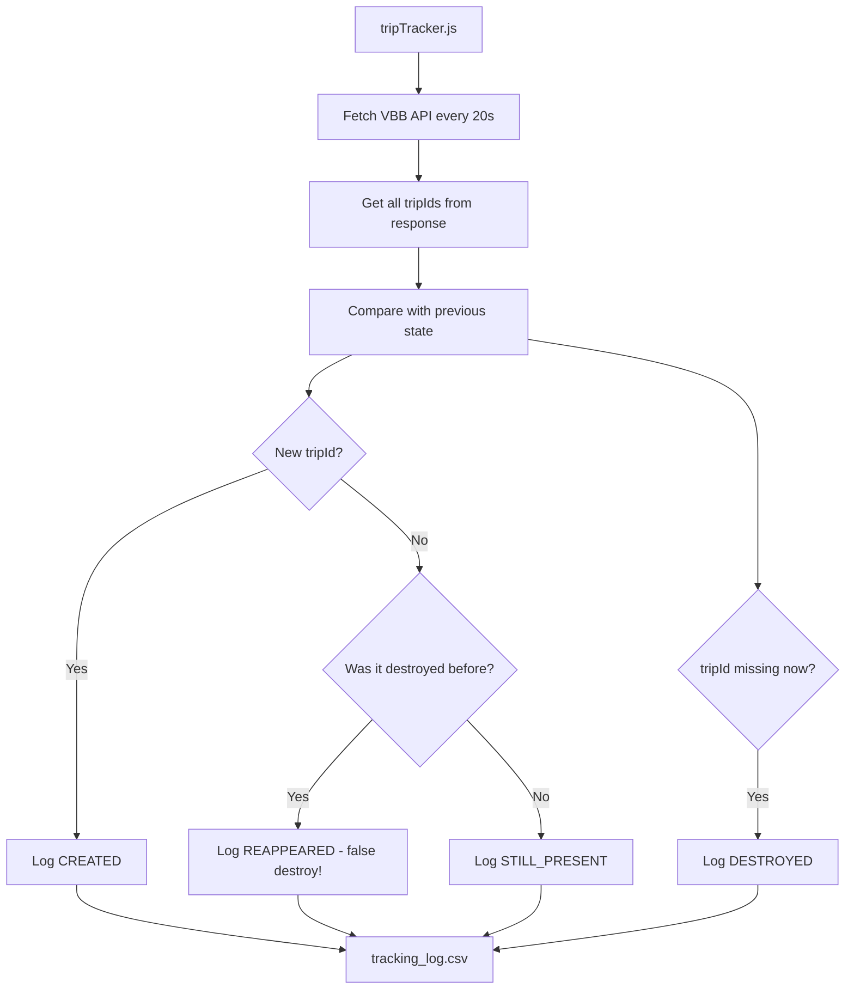

# TripId Tracking Mechanism Design

## Overview

A standalone Node.js script to track **ALL** VBB tripIds and log their lifecycle events to a CSV file. This helps debug the 256 vehicle limit issue by distinguishing between:

- **False destroys**: TripId dropped due to 256 limit, reappears later
- **True journey completions**: TripId disappears permanently (journey ended)

## Focus TripIds (for filtering/analysis)

```
1|76134|28|86|16122025
1|72324|3|86|16122025
1|76166|0|86|16122025
```

These are highlighted in the CSV with `isFocused=true`, but ALL tripIds are tracked.

## Architecture



## File Structure

```
learning_maps/
├── tripTracker.js      # NEW - Standalone tracking script
├── tracking_log.csv    # NEW - Output CSV file
├── map.js              # Existing - unchanged
├── vbb_data.js         # Existing - unchanged
└── ...
```

## tripTracker.js Design

### Configuration
```javascript
const FOCUS_TRIP_IDS = [
    '1|76134|28|86|16122025',
    '1|72324|3|86|16122025', 
    '1|76166|0|86|16122025'
];
const POLL_INTERVAL = 20000; // 20 seconds
const CSV_FILE = 'tracking_log.csv';
```

### State Management
```javascript
// Track ALL tripIds
const allTrips = new Map();
// Key: tripId
// Value: { 
//   present: boolean, 
//   firstSeen: Date, 
//   lastSeen: Date,
//   destroyCount: number,  // How many times it was destroyed
//   reappearCount: number, // How many times it reappeared
//   data: object 
// }
```

### Event Types

| Event | Description | Indicates |
|-------|-------------|-----------|
| `CREATED` | TripId appeared for first time | New journey started |
| `DESTROYED` | TripId no longer in response | Possibly 256 limit OR journey ended |
| `REAPPEARED` | TripId came back after destroy | **Confirms 256 limit issue!** |
| `STILL_PRESENT` | TripId continues to be visible | Journey ongoing |

### CSV Output Structure

```csv
timestamp,tripId,event,isFocused,totalVehiclesInResponse,destroyCount,reappearCount,name,direction,latitude,longitude
2025-12-16T20:30:00.000Z,1|76134|28|86|16122025,CREATED,true,245,0,0,U5,Hönow,52.5123,13.4567
2025-12-16T20:30:20.000Z,1|76134|28|86|16122025,DESTROYED,true,256,1,0,,,,
2025-12-16T20:30:40.000Z,1|76134|28|86|16122025,REAPPEARED,true,248,1,1,U5,Hönow,52.5130,13.4580
2025-12-16T20:31:00.000Z,1|99999|10|86|16122025,DESTROYED,false,250,1,0,,,,
```

### Key Columns Explained

- **isFocused**: `true` if tripId is in your focus list, makes filtering easy
- **totalVehiclesInResponse**: Number of vehicles returned (max 256)
- **destroyCount**: How many times this tripId has been destroyed
- **reappearCount**: How many times it came back after being destroyed
  - If `destroyCount > reappearCount`, trip may have ended
  - If `destroyCount == reappearCount`, all destroys were false (256 limit)

## Usage

```bash
# Run the tracker
node tripTracker.js

# Stop with Ctrl+C
# Analyze tracking_log.csv
```

## Analysis Queries

After collecting data, you can analyze the CSV:

1. **Find false destroys**: Filter where `event=REAPPEARED`
2. **Find true journey ends**: Filter where `event=DESTROYED` and no subsequent `REAPPEARED` for same tripId
3. **256 limit correlation**: Filter where `totalVehiclesInResponse=256` and `event=DESTROYED`
4. **Focus on specific trips**: Filter where `isFocused=true`

## Expected Insights

1. If `REAPPEARED` events are common → 256 limit is causing false destroys
2. If `DESTROYED` happens often when `totalVehiclesInResponse=256` → confirms limit issue
3. Trips that are `DESTROYED` and never `REAPPEAR` → true journey completions

## Next Steps

Switch to Code mode to implement `tripTracker.js`
