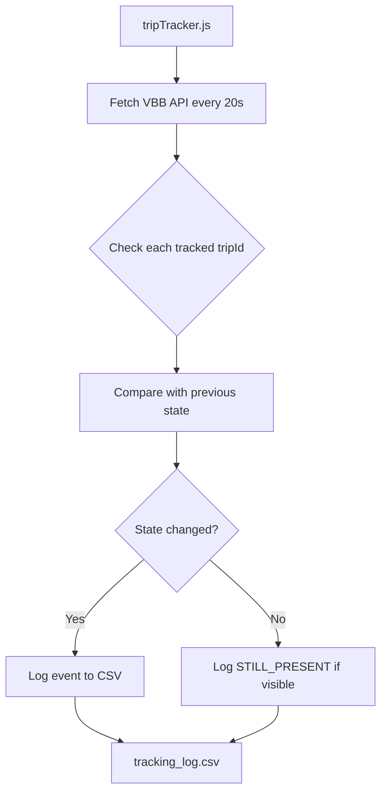

# TripId Tracking Mechanism Design

## Overview

A standalone Node.js script to track specific VBB tripIds and log their lifecycle events to a CSV file. This helps debug the 256 vehicle limit issue by monitoring when specific vehicles appear and disappear from API responses.

## Tracked TripIds

```
1|74561|0|86|16122025
1|72324|3|86|16122025
1|76166|0|86|16122025
```

## Architecture



## File Structure

```
learning_maps/
├── tripTracker.js      # NEW - Standalone tracking script
├── tracking_log.csv    # NEW - Output CSV file
├── map.js              # Existing - unchanged
├── vbb_data.js         # Existing - unchanged
└── ...
```

## tripTracker.js Design

### Configuration
```javascript
const TRACKED_TRIP_IDS = [
    '1|76134|28|86|16122025',
    '1|72324|3|86|16122025', 
    '1|76166|0|86|16122025'
];
const POLL_INTERVAL = 20000; // 20 seconds
const CSV_FILE = 'tracking_log.csv';
```

### State Management
```javascript
// Track previous state of each tripId
const tripState = new Map();
// Key: tripId
// Value: { present: boolean, lastSeen: Date, data: object }
```

### Event Types

| Event | Description |
|-------|-------------|
| `CREATED` | TripId appeared in API response for first time |
| `DESTROYED` | TripId was present before but not in current response |
| `REAPPEARED` | TripId was destroyed but appeared again |
| `STILL_PRESENT` | TripId continues to be in API response |
| `STILL_ABSENT` | TripId continues to be missing from API response |

### CSV Output Structure

```csv
timestamp,tripId,event,totalVehicles,name,direction,latitude,longitude
2025-12-16T20:30:00.000Z,1|76134|28|86|16122025,CREATED,245,U5,Hönow,52.5123,13.4567
2025-12-16T20:30:20.000Z,1|76134|28|86|16122025,STILL_PRESENT,251,U5,Hönow,52.5125,13.4570
2025-12-16T20:30:40.000Z,1|76134|28|86|16122025,DESTROYED,256,,,
```

### Key Functions

1. **fetchVBBData()** - Calls the VBB radar API
2. **checkTrackedTrips(movements)** - Compares current data with previous state
3. **logEvent(tripId, event, totalVehicles, movementData)** - Appends to CSV
4. **startTracking()** - Main loop with setInterval

## Usage

```bash
# Run the tracker
node tripTracker.js

# Stop with Ctrl+C
# CSV file will be in the same directory
```

## Insights This Will Provide

1. **Frequency of destruction** - How often do tracked tripIds disappear?
2. **Reappearance patterns** - Do they come back in the next poll?
3. **Correlation with total count** - Do disappearances happen when totalVehicles = 256?
4. **Duration tracking** - How long do trips stay visible before disappearing?

## Next Steps

Switch to Code mode to implement `tripTracker.js`
